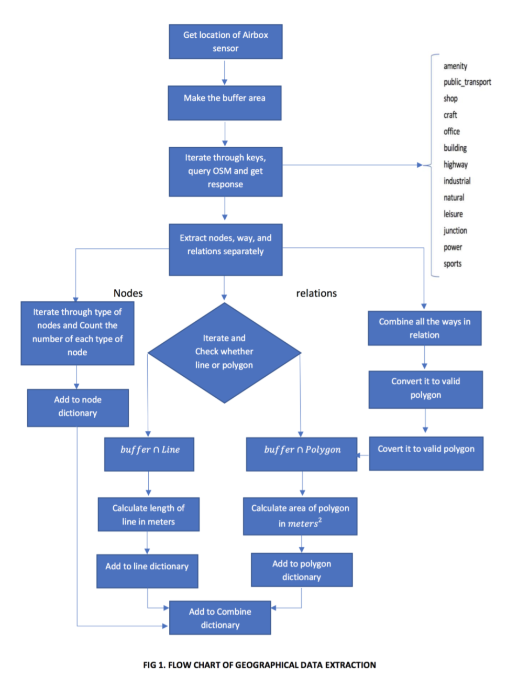
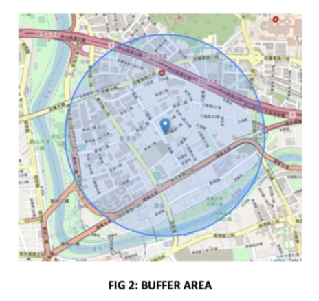
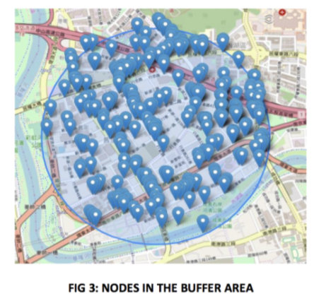
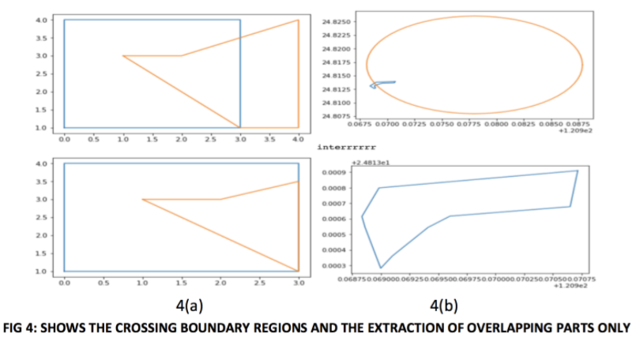
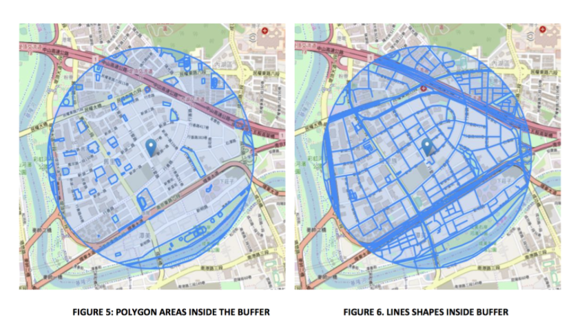

# GeographicalDataExtraction-
This script scrape data from openstreet map in a selected area. For complete details read the Geographical_data_extraction_read.PDF file. For an overview just go through below pics.

  Here is the complete flow chart of how the algorithm works

* Step:1
 
An area of one km radius is selected first.
 

 
All the nodes in that area are scrapped. The Json files include all the properties. 
 

 
This algorithm cut off the areas outside the buffer area in this way. 
 

 

Finally we obtain all the entities, Polygons, road networks.
 

 
